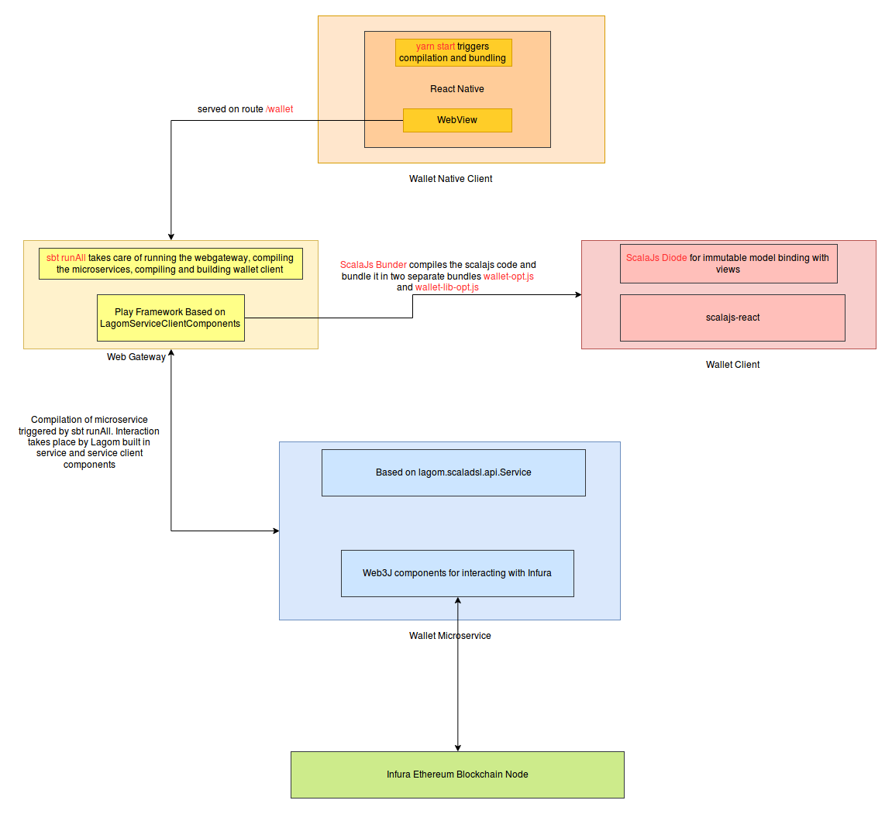

# Architectural Overview

## Bird's Eye View

Here is the bird's eye view of architecture



## Overview

Primarily there are four projects

* [Web client](client/index.md) - based on `scalajs-react` library in wallet-client directory
* [Native client](native_client/index.md) - based on `react-native` applicationin wallet-native-client directory
* [Web gateway](web_gateway/index.md) : Proxy between wallet service and wallet client
* [Wallet Service](wallet_service/index.md) : A Lagom microservice for wallet api.

Web client and Native client are connect with each other with a simple web view component similar to this in [wallet-native-client\App.js](https://github.com/LivelyGig/wallet/blob/master/wallet-native-client/App.js#L12)

```
<WebView
    source={{uri: 'http://10.0.2.2:9000/wallet/'}}
    style={{marginTop: 20}}
/>
```
Where the uri is the url of the running web gateway. It runs on `9000` port usually but at times the error in wallet service can result in web gateway to not load properly resulting in connection refused error. In that case look at terminal for output similar to

```
[info] Service WebGateway listening for HTTP on 0:0:0:0:0:0:0:0:63376
```
and use that port instead.
